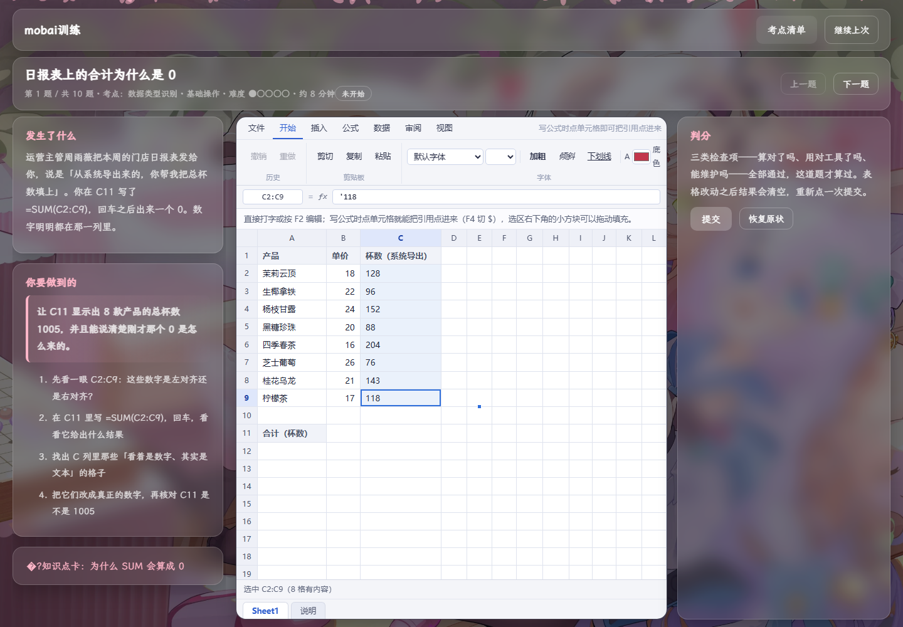

# 研数通途

一个自己用来练数据分析的网站，**目前仍在开发中**。

起因是看教程、刷题都做过，但真拿到一张脏表还是不知道从哪下手。所以换个做法：不给选择题，直接扔一张真实业务里会遇到的表过来，让我自己动手做，做完由程序判分。

只有 Excel 模块有内容，其余模块是占位。做得比较慢，也还很不完整，但如果你也在学数据分析、或者想自己搭一个类似的东西，欢迎拿去改。有更好的做法也请直接说。

## 当前状态

| 模块              | 状态        |
| --------------- | --------- |
| Excel           | 可用，10 道练习 |
| SQL             | 未开始       |
| Python · Pandas | 未开始       |
| 数据可视化           | 未开始       |
| 综合案例            | 未开始       |

## 截图

首页


Excel 模块页——考点清单与进度


练习页——左边是任务，右边是可操作的表格



## 它是怎么练的

10 道题共用同一家公司：**云栖茶饮**，一个 12 家门店的连锁奶茶品牌。每题只练一个考点，前后连成一条线。

| #   | 要解决的业务问题        | 考点                          |
| --- | --------------- | --------------------------- |
| 1   | 日报表上的合计为什么是 0   | 数据类型识别                      |
| 2   | 写一份档位改了也不会崩的提成表 | 区域选择与引用                     |
| 3   | 上周哪几款产品在亏钱      | `SUMIF`                     |
| 4   | 哪个门店周末卖得最好      | `SUMIFS`                    |
| 5   | 给会员自动分等级        | `IF` / `IFS`                |
| 6   | 把订单和门店信息拼成一张表   | `VLOOKUP`                   |
| 7   | 按姓名反查工号（查找列在右边） | `XLOOKUP` / `INDEX`+`MATCH` |
| 8   | 从订单编号里拆出日期和门店代码 | `LEFT` / `MID` / `FIND`     |
| 9   | 算每笔订单的逾期天数      | 日期函数                        |
| 10  | 给一张会被填错的登记表加防呆  | `IFERROR` + 数据验证            |

每题都埋了一个坑，坑就是这一题要教的东西。第 7 题刻意排在第 6 题后面——先用 `VLOOKUP` 撞一次墙（查找列在右边就是查不出来），再换工具。先失败，再学。

每题配一张知识点卡，短到一屏能读完，折叠在练习页左栏，随时可以展开，不设阅读门槛。

## 判分

提交后逐项反馈，三类检查项各查各的，**全部通过才算过**：

| 检查项  | 在问什么               |
| ---- | ------------------ |
| 结果值  | 算对了吗               |
| 所用函数 | 用对工具了吗             |
| 引用结构 | 以后改数据还能用吗（该锁的有没有锁） |

不通过时给的是方向提示，不是答案。提交次数不限，但会记下来——「一次就过」和「试了六次才过」，就是以后复习顺序的依据。

表格里的错误值（`#N/A`、`#VALUE!` 等）配了中文成因解释，比如会告诉你 `#N/A` 最常见的原因是查找值不在所选区域的第一列，而不是只甩一个错误码。

## 在线访问

https://mobaiyuyi.github.io/data-analysis-practice-site/

进度存在浏览器本地，换设备不会同步，需要手动导出再导入。

## 本地打开

不用装任何东西，也没有构建步骤：

```
双击 index.html
```

或者克隆下来直接用：

```bash
git clone https://github.com/mobaiyuyi/data-analysis-practice-site.git
```

## 目录结构

```
index.html            首页：技能树与进度
excel.html            Excel 模块：考点清单
exercise.html         练习页（exercise.html?id=excel-01）

assets/
  styles.css          全部样式
  sakura.js           背景樱花粒子

js/
  sheet.js            表格网格
  ribbon.js           顶部功能区
  fill.js             填充序列
  format.js           数字格式
  grading.js          判分
  progress.js         进度存储
  page-home.js        首页
  page-module.js      模块页
  page-exercise.js    练习页
  formula/
    parser.js         公式 → AST
    evaluator.js      AST 求值
    functions.js      函数实现
    errors.js         错误码中文解释
    utils.js          工具函数

data/
  exercises.js        10 道练习
  cards.js            10 张知识点卡
  universe.js         云栖茶饮的共享常量
```

## 一些技术上的选择

**没有框架、没有依赖、没有构建。** 静态多页站点，打开 HTML 就是全部。这是为了让我自己随时能改，过半年回来看还认得。

**题库写成 `.js` 而不是 `.json`。** 浏览器在 `file://` 协议下禁止 `fetch` 本地 JSON，但允许 `<script src>`。写成 `.js` 就能双击 HTML 直接跑，不用起本地服务器。

**判分基于 AST，不用字符串匹配。** 因为判分要回答「用了哪个函数、引用了哪个区域、有没有绝对引用」，只有解析成语法树才答得准。`VLOOKUP(A2,B:C,2,0)` 和 `VLOOKUP ( A2 , B:C , 2 , 0 )` 是同一个公式。

**公式引擎是自己写的**，覆盖求和、条件聚合、逻辑判断、查找、文本、日期等类别的常用函数。倒不是想造轮子，而是判分必须能看进公式内部，现成的表格库给不了这个。

## 已知的不足

- 只支持单工作表，不支持 `Sheet2!A1` 这种跨表引用
- 不支持不连续区域，比如 `A1:A5,C1:C5`
- 屏幕宽度小于 1024px 时降级为只读，手机上只能看知识点卡和进度，不能练
- 没有后端、没有账号、没有云同步，进度只在本地浏览器里
- 排序、筛选、冻结窗格、条件格式、透视表、图表都没做

## 说明

个人自用项目，边学边写。内容里的「云栖茶饮」是虚构的，数据也是编的。

如果它帮到了你，那就挺好。发现问题或者有更好的写法，欢迎提 issue。
